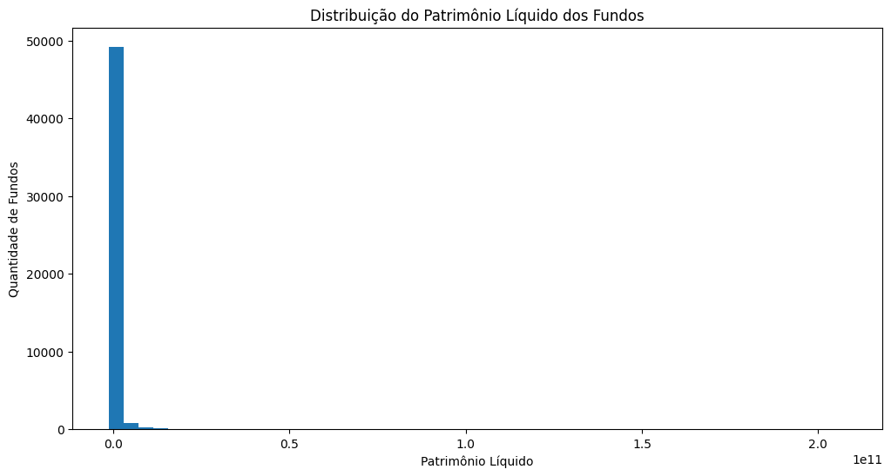
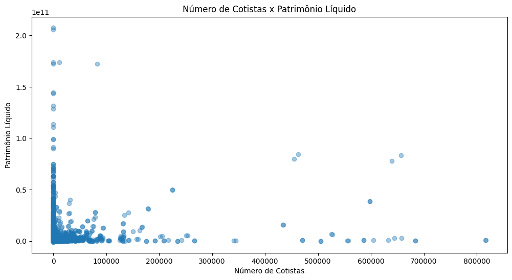
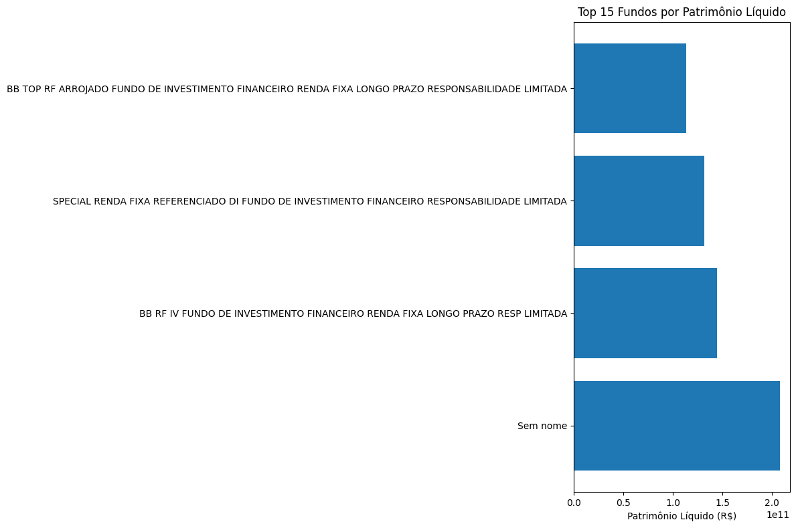
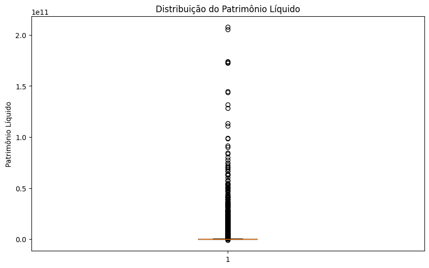

# Relatório

> [!CAUTION]
>
> - Você <ins>**não pode utilizar ferramentas de IA para escrever este relatório**</ins>.

## Identificação

- **Nome**: <mark>`Patrick Alves de Queiros`</mark>
- **Cartão UFRGS:** <mark>`00287729`</mark>

## Dados utilizados

> [!IMPORTANT]
>
> - Os dados utilizados devem ser informados como **links** para as fontes originais.
> - Se houver mais de um conjunto de dados, liste todos separadamente.
> - Para cada conjunto de dados, inclua também uma **descrição curta** explicando os dados.

1. **Dataset 1**: <mark>`https://dados.cvm.gov.br/dados/FI/DOC/INF_DIARIO/DADOS/`</mark>
    * **Descrição curta**: <mark>`Conjunto de dados de informações diárias dos fundos de investimento disponibilizado pela CVM.`</mark>
2. **Dataset 2**: <mark>`https://dados.cvm.gov.br/dados/FI/CAD/DADOS/cad_fi.csv`</mark>
    * **Descrição curta**: <mark>`Cadastro dos fundos de investimento da CVM.`</mark>
3. ...

## Código-fonte da visualização

> [!IMPORTANT]
>  
> - Indique abaixo onde está, dentro deste repositório, o código-fonte usado para gerar a visualização.

- **Arquivo principal**: <mark>`Trabalho_CVM.ipynb`</mark>
- **Arquivos complementares (se houver)**: <mark>`Nenhum`</mark>

## Imagem da visualização gerada

> [!IMPORTANT]
>
> - Insira aqui uma imagem da visualização criada por você. Troque `imagem-da-visualizacao.png` pelo caminho correto do arquivo no repositório. 
> - Se você criou alguma visualização interativa, então descreva aqui como acessá-la. Por exemplo, se for uma página HTML, coloque o link, ou se for uma visualização 3D, descreva como compilar e executar o código. 

### Histograma

### Scatter Plot

### Top 15 Fundos

### Boxplot

## Descrição da visualização

### Legenda (*caption*)

> [!IMPORTANT]
>
> - A visualização apresenta informações sobre os fundos de investimento brasileiros utilizando dados da Comissão de Valores Mobiliários (CVM). Os gráficos exploram a distribuição do patrimônio líquido dos fundos, a relação entre número de cotistas e patrimônio, os maiores fundos em termos de patrimônio e a concentração dos recursos no mercado. Os eixos representam métricas financeiras e quantitativas dos fundos, permitindo comparar tamanho, popularidade e concentração de capital.

<mark>`<preencher>`</mark>

### Conclusão demonstrada pela visualização

> [!IMPORTANT]
>
> - Os resultados indicam que o mercado de fundos de investimento brasileiro apresenta elevada concentração de patrimônio. Embora existam milhares de fundos registrados, uma pequena parcela concentra a maior parte dos recursos investidos.

<mark>`<preencher>`</mark>
